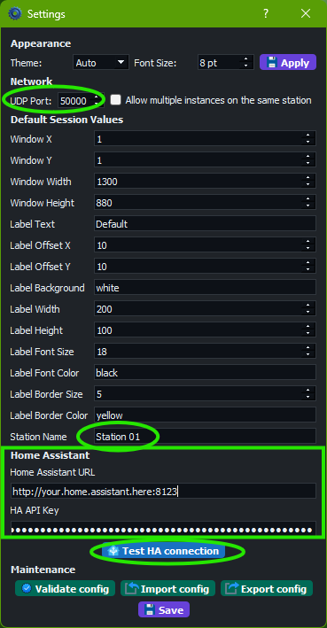
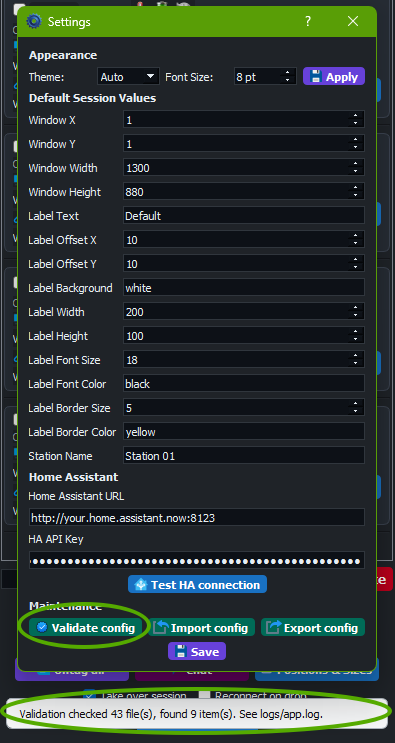
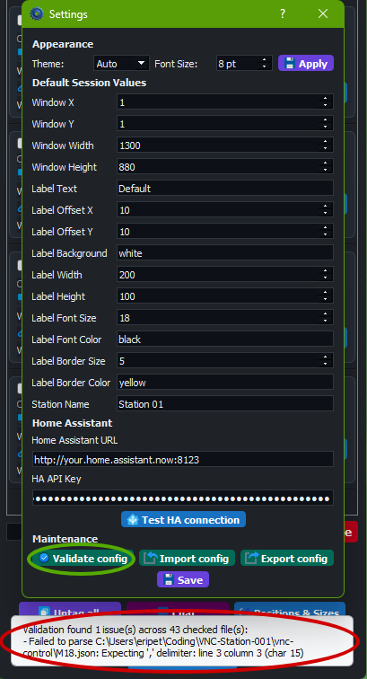
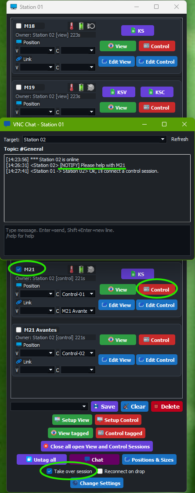

# VNC Station Admin Guide

Audience: administrators deploying and maintaining stations.  
App version: `1.4.1`

## Quick Start [Admin]

1. Verify file/folder structure (`tvnviewer.exe`, `default.json`, `vnc-*` folders).
2. Configure station settings (`station name`, `UDP Port`, HA settings if used).
3. Keep `Allow multiple instances on the same station` disabled unless explicitly needed.
4. Validate configuration, then run cross-station UDP test.
5. Export a known-good config bundle.

For operation workflows, see [User Guide](user-guide.md).  
For configuration workflows, see [Advanced User Guide](advanced-user-guide.md).

## 1. Scope [Admin]

This guide covers:

- deployment prerequisites
- required folder/file layout
- network and firewall compatibility
- UDP port coordination
- validation/import/export workflows

## 2. Deployment Checklist [Admin]

Each station should include:

- application executable/package
- `tvnviewer.exe` in app root
- `default.json` in app root
- optional `default.local.json` in app root
- `vnc-view/` and `vnc-control/` with required `.vnc` files
- optional JSON overrides for view/control sessions
- optional `vnc-positions/` presets
- optional `vnc-setups/` presets

## 3. Critical VNC Password Setup [Admin]

This is mandatory for correct operation.

- Every `.vnc` file must have its password saved in the file.
- Save/update `.vnc` passwords using `tvnviewer.exe` before deployment.
- On each VNC Server target, configure separate access credentials:
  - one password for `View`
  - one password for `Control`

Do:

- validate that `vnc-view/*.vnc` files connect with View credentials
- validate that `vnc-control/*.vnc` files connect with Control credentials
- re-save `.vnc` files after any server-side password change

Do not:

- deploy `.vnc` files without saved passwords
- use one shared password for both View and Control modes

## 4. Verify Runtime Folder Structure [Admin]

Expected operational directories:

- `vnc-view`
- `vnc-control`
- `vnc-positions`
- `vnc-setups`
- `logs`

Use `Validate config` in app to detect missing/malformed artifacts after deployment.

## 5. Initial Station Configuration [Admin]

Prerequisites: App launches and settings window opens.

1. Open `Change Settings`.
2. Set station name (if needed).
3. Set shared `UDP Port` (must match all stations).
4. Decide whether to enable `Allow multiple instances on the same station` (recommended default: disabled).
5. Set HA URL/API key if HA is used.
6. Run `Test HA connection`.
7. Save.



Figure 1: Settings window for station identity, UDP, HA, and maintenance tools.

## 6. UDP Network Compatibility [Admin]

All stations must:

- be on reachable network segments for UDP broadcast
- use exactly the same UDP port in app settings
- allow UDP inbound/outbound for that port in host firewall

Recommended test using bundled script:

```powershell
.\tests\scripts\udp-port-test.ps1 -Mode listen -Port <UDP_PORT>
.\tests\scripts\udp-port-test.ps1 -Mode send -Port <UDP_PORT> -TargetIP <TARGET_IP> -Message "UDP test"
```

Firewall rule example (PowerShell as Admin, shown for port `50000`):

```powershell
New-NetFirewallRule -DisplayName "VNC Station UDP 50000" -Direction Inbound -Protocol UDP -LocalPort 50000 -Action Allow
```

If you use another port, change `50000` accordingly.

## 7. Validation And Configuration Maintenance [Admin]

In `Change Settings`:

- `Validate config` checks core files and JSON validity.
- `Export config` creates backup bundle for migration.
- `Import config` restores a bundle to a station and rejects unsafe zip paths that try to escape the repo folders.
- If the Settings window is already open during import, its visible fields now refresh immediately from the imported defaults.




Figure 2: Validation feedback examples.

## 8. Config Replication Between Stations [Admin]

Prerequisites: One reference station is fully verified.

1. Build/verify one reference station.
2. Export configuration bundle.
3. Import bundle on target stations.
4. Verify station-specific values:
   - station name
   - UDP port
   - HA credentials (if different)
5. Run `Validate config` after import.

## 9. Operational Guardrails [Admin]

Do:

- keep all stations on same app version during a shift
- keep UDP port consistent across stations
- keep View and Control passwords separated on VNC Server side
- require validation after manual file edits
- keep regular config exports as backups

Do not:

- enable `Allow multiple instances on the same station` without explicit need
- keep `Take over session` enabled as default operating state

## 10. Troubleshooting [Admin]

| Symptom | Likely cause | Quick fix |
|---|---|---|
| Stations do not discover each other | UDP port mismatch or firewall block | Verify same port, open firewall, run UDP test both directions |
| App says another instance is running | Single-instance protection active | Close existing instance or enable multi-instance setting intentionally |
| Sessions fail to launch | Missing `tvnviewer.exe` or `.vnc` files | Verify file layout and run `Validate config` |
| VNC auth fails when opening session | Password missing/wrong in `.vnc` or wrong server password mapping | Re-save `.vnc` with `tvnviewer.exe` and verify separate View/Control passwords on server |
| Indicators/chat inconsistent | HA/network/config mismatch | Verify HA settings, version alignment, and logs |
| Operators report “No sessions were opened” with station names in toast | Target sessions are already held on another station | Use the toast details to identify the holder, coordinate handoff, or use takeover intentionally |

## 11. Suggested Acceptance Test After Deployment [Admin]

1. Launch app and confirm connection rows load.
2. Open one View session.
3. Open one Control session.
4. Test chat between two stations.
5. Test takeover flow on non-critical session.
6. Test `Close all open View and Control Sessions`.
7. Run `Validate config`.
8. Export a backup bundle.



