# VNC Station Advanced User Guide

Audience: power users who configure layouts, session behavior, and sensor-driven UI behavior.  
App version: `1.3.4`

## Quick Start [Advanced]

1. Configure position presets in `Positions & Sizes` -> `Position`.
2. Configure per-session geometry/labels in `Positions & Sizes` -> `Session` or `Edit View` / `Edit Control`.
3. Configure links (`Link V` / `Link C`) and Active Folder behavior.
4. Configure HA sensor icons and optional color rules.
5. Save and validate setup presets for operators.

For operator execution flow, see [User Guide](user-guide.md).  
For deployment/network/firewall, see [Admin Guide](admin-guide.md).

## 1. What This Guide Covers [Advanced]

- Position presets and session-specific layout tuning.
- Setup presets for operators.
- Linked sessions (`Link V` / `Link C`).
- Active Folder and custom Active button labels.
- Home Assistant sensor icon and color mapping.

## 2. Configure Position Presets (Global) [Advanced]

Prerequisites: `Positions & Sizes` tool available and target monitor layout decided.

Use `Positions & Sizes` in `Position` mode to create reusable monitor layouts.

1. Open `Positions & Sizes`.
2. Select `Position` mode.
3. Place and size VNC preview for target monitor area.
4. Save the preset name.
5. Reuse via row `Pos V` / `Pos C`.

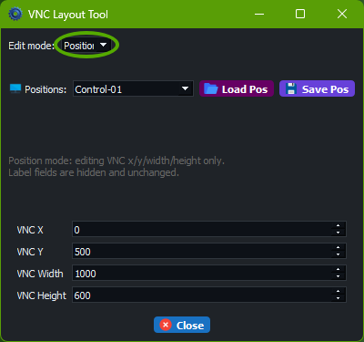
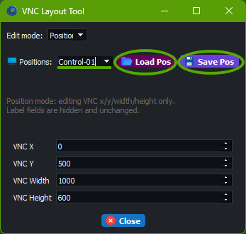

Figure 1: Position mode for reusable geometry presets.

Important note:

- Label setup is not configured in `Position` mode.
- Configure labels in `Positions & Sizes` -> `Session` mode.
- Those label settings are also used when a `Pos V` / `Pos C` position preset is selected.

## 3. Configure Session Layout (Per Connection/Mode) [Advanced]

Prerequisites: Connection has matching `.vnc` and (optional) JSON settings file.

Use `Positions & Sizes` in `Session` mode or row `Edit View` / `Edit Control`.

Key settings:

- window geometry (`x`, `y`, `width`, `height`)
- label text and offset
- label size, font, border, and colors
- optional `position_name` override: if a valid position preset name is set, that preset geometry is used; otherwise the session's own `x/y/width/height` values are used

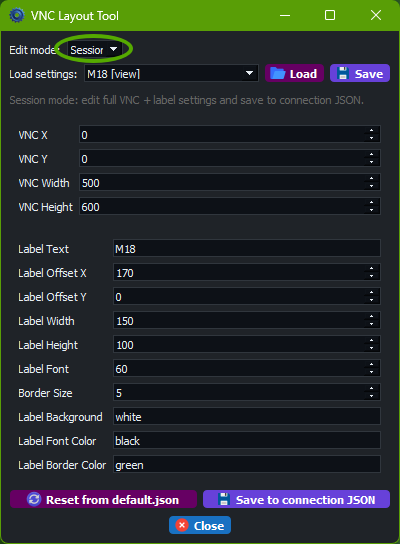

Figure 2: Session mode for per-connection geometry and label configuration.

`Edit View` / `Edit Control` dialog:

- per-session direct editor
- includes HA sensor mapping, label style, and runtime behavior settings
- useful when you want to edit one session without using the layout tool windows

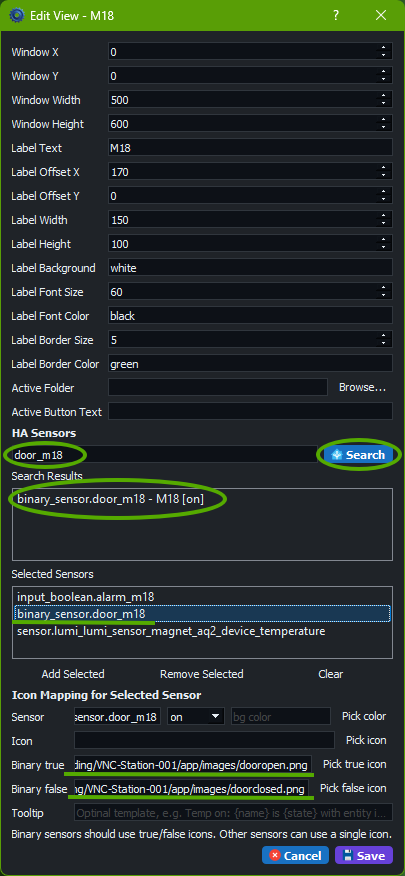

Figure 3: Per-session edit dialog with HA mapping controls.

## 4. Configure Setup Presets For Operators [Advanced]

Prerequisites: Positions, links, and tags are prepared for target operation mode.

A setup stores:

- row tags
- selected `Pos V` / `Pos C`
- selected `Link V` / `Link C`

Recommended process:

1. Prepare row positions and links.
2. Tag the set operators should open quickly.
3. Save setup with clear production name.
4. Validate by loading and running `Setup View` and `Setup Control`.

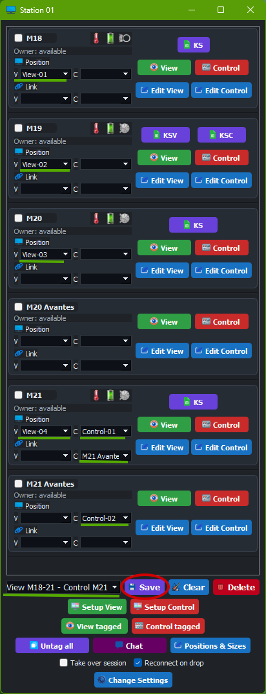

Figure 4: Save/apply cycle for setup presets.

## 5. Link Sessions [Advanced]

Prerequisites: Intended session pairs are defined and tested.

`Link V` / `Link C` lets one row action open/close a related session chain.

Use when:

- one production machine should always open with helper/support machine
- paired diagnostics should open together

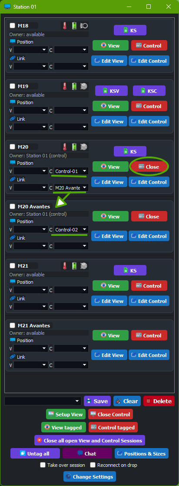

Figure 5: Linked session open behavior.

## 6. Configure Active Folder And Button Labels [Advanced]

Prerequisites: File/folder path exists and is reachable from station runtime account.

Per session mode (`Edit View` / `Edit Control`):

- set `Active Folder` to file or folder path
- optionally set custom `Active Button Text`
- row button opens configured file, or latest file in configured folder

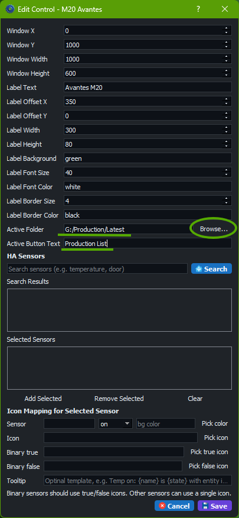
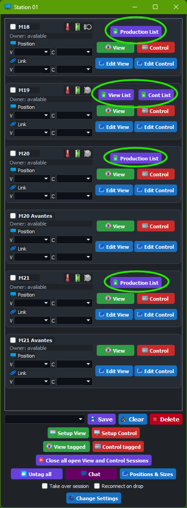

Figure 6: Active file/folder integration from row buttons.

## 7. Home Assistant Sensor Mapping [Advanced]

Prerequisites: Valid HA URL/API key configured in settings.

For each sensor mapping you can configure:

- one generic icon (`icon`)
- separate binary icons (`icon_on`, `icon_off`)
- tooltip template using `{name}`, `{state}`, `{entity_id}`
- optional binary state background rules (`bg_state`, `bg_color`)

Figure 7: Sensor mapping controls in the session edit dialog.

Behavior notes:

- multiple icons can be shown in one row
- icon can change by true/false state
- icon area background can change by sensor state
- overlay label background on open VNC session can change by sensor state

Do:
- test both alarm and normal states after saving mappings
- keep tooltip templates short and clear

Do not:
- reuse ambiguous icon names/colors for critical alarms

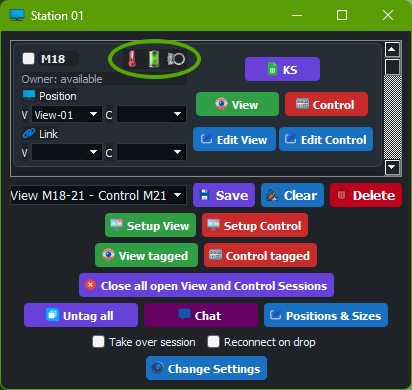
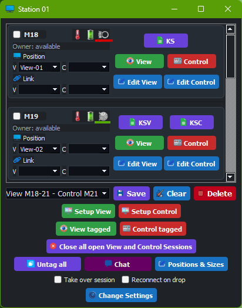
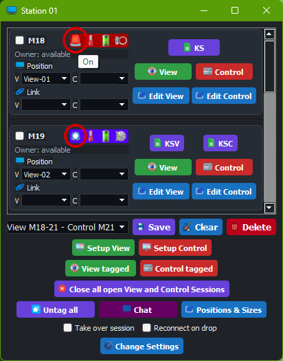
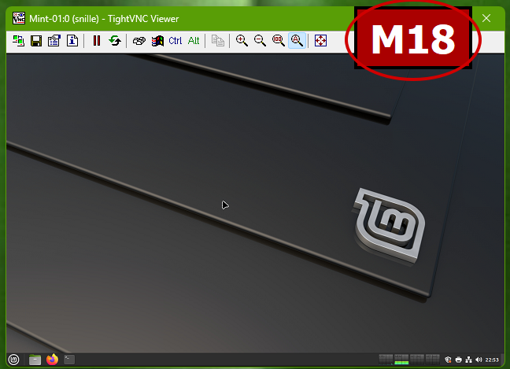

Figure 8: Indicator and alarm visual states, including label background behavior.

## 8. Validation Routine After Changes [Advanced]

1. Open one View row manually and verify placement.
2. Open one Control row manually and verify placement.
3. Test linked open/close behavior.
4. Test tagged open/close behavior.
5. Confirm sensor icons and alarm colors.
6. Confirm `Close all open View and Control Sessions` closes everything cleanly.

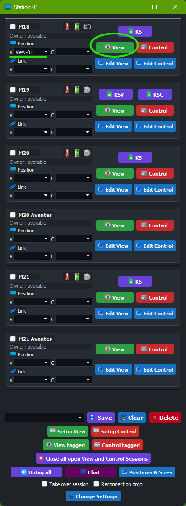
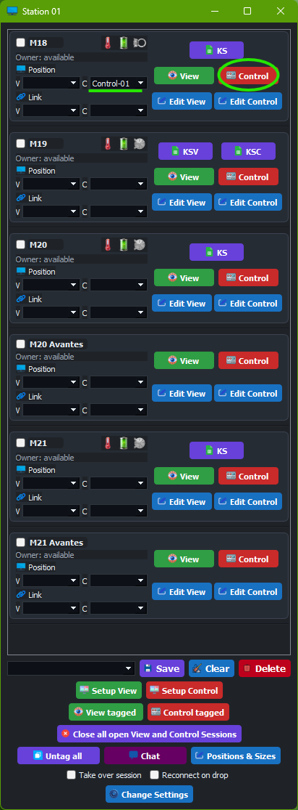
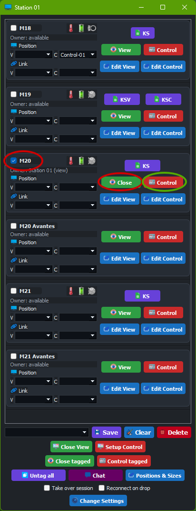

Figure 9: Basic smoke-test operations after configuration changes.

## 9. Troubleshooting [Advanced]

| Symptom | Likely cause | Quick fix |
|---|---|---|
| Position preset has no effect | `Pos V`/`Pos C` not selected or invalid `position_name` | Re-select preset and verify preset exists |
| Label appears wrong when using positions | Label edited in wrong place | Edit labels in `Session` mode, not `Position` mode |
| Active button opens wrong file | Folder contains newer unexpected file | Check folder contents and modification times |
| Sensor icons not updating | HA credentials or entity mapping issue | Re-test HA connection and verify entity IDs |

## 10. Handover Notes For Operators [Advanced]

Before handover to production personnel:

- save and name setup clearly
- ensure required positions exist
- ensure label position/text/style are validated
- ensure linked pairs are intentional
- ensure Active Folder paths are valid
- ensure sensor mapping and alarm visuals are tested
