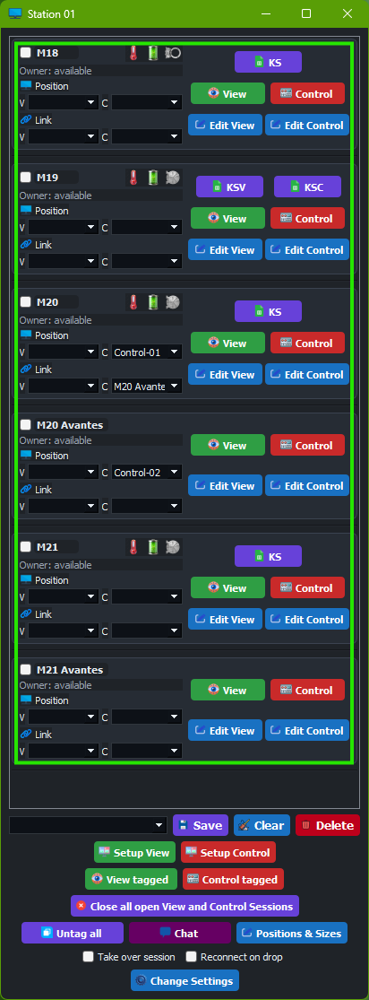
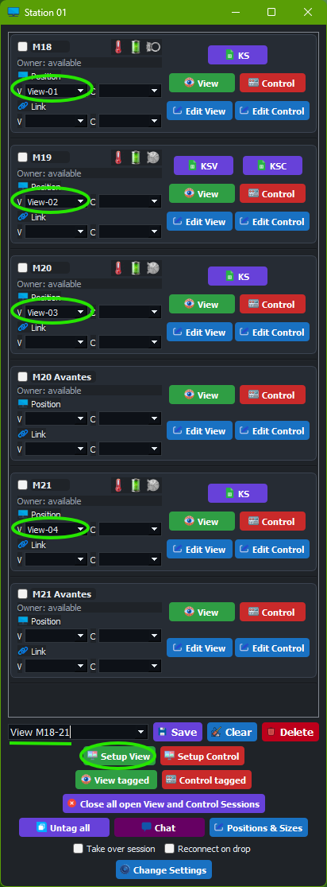
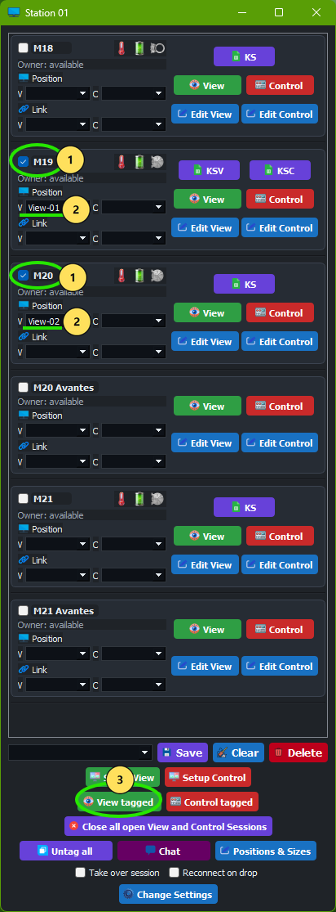
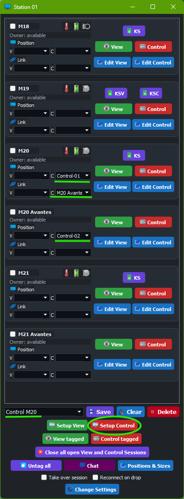
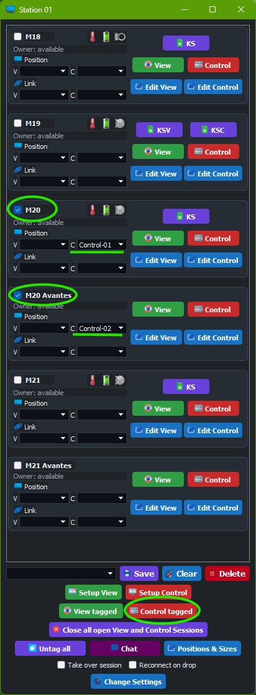
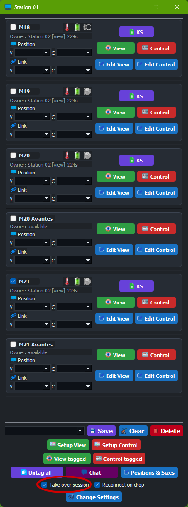
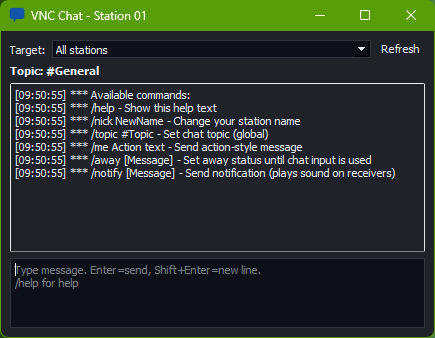

# VNC Station User Guide

Audience: production personnel using the app during normal operation.  
App version: `1.4.1`

## Quick Start [Operator]

1. Start the app and wait a few seconds for station/session sync.
2. Load your saved setup from the setup selector.
3. Open `Setup View` for monitoring screens.
4. Open `Control` or `Control tagged` only when intervention is needed.
5. Use `Close all open View and Control Sessions` at shift end.

For setup/position/session/label/sensor configuration, see [Advanced User Guide](advanced-user-guide.md).
For install/network/firewall issues, see [Admin Guide](admin-guide.md).

## 1. What This Guide Covers [Operator]

- Opening and closing View/Control sessions.
- Using tagged actions and saved setups.
- Handling alarms, takeover, and chat during production.

## 2. Main Window Orientation [Operator]

The main window contains:

- One row per machine/session target.
- Row actions: `View`, `Control`, `Edit View`, `Edit Control`.
- Mode assignment: `Pos V` and `Pos C`.
- Link assignment: `Link V` and `Link C`.
- Bottom action rows:
  - setup selector + `Save` + `Clear Setup` + `Delete`
  - `Setup View` / `Setup Control`
  - `View tagged` / `Control tagged`
  - `Close all open View and Control Sessions`
  - `Untag all` + `Chat` + `Positions & Sizes`
  - `Take over session` + `Reconnect on drop`
  - `Change Settings`

Figure 1: Main operator window with row actions and bottom control rows.

## 3. Standard Shift Workflow [Operator]

Prerequisites: Saved setup exists and position assignments are already prepared.

1. Start the app and wait for session sync.
2. Load your saved setup from the setup selector.
3. Open View sessions with `Setup View` or `View tagged`.
4. Open Control sessions only when intervention is needed.
5. Monitor indicators and labels continuously.
6. Coordinate in chat for help or handover.

## 4. View Workflows [Operator]

### 4.1 Open Saved View Layout

Prerequisites: Target setup exists and has valid `Pos V` assignments.

1. Select setup.
2. Confirm `Pos V` assignments.
3. Click `Setup View`.

Figure 2: Saved view setup opened across assigned monitors.

### 4.2 Open Temporary Tagged View Group

Prerequisites: Target rows are visible and have `Pos V` set.

1. Tag target rows.
2. Confirm `Pos V`.
3. Click `View tagged`.

Figure 3: Tagged rows opened in View mode.

## 5. Control Workflows [Operator]

### 5.1 Open Control Set

Prerequisites: `Pos C` and (if used) `Link C` are already configured.

1. Confirm `Pos C` and any `Link C` relations.
2. Click `Setup Control` for the full prepared set.

Figure 4: Setup Control opening the prepared control set.

### 5.2 Open Tagged Control Set

Prerequisites: Relevant rows tagged.

1. Tag affected machines.
2. Click `Control tagged`.

Figure 5: Tagged control workflow.

## 6. Close Sessions Quickly [Operator]

- To close one session, click row `View` or `Control` again (button toggles to close).
- To close all currently open local sessions, use `Close all open View and Control Sessions`.

## 7. Takeover And Collaboration [Operator]

Prerequisites: Coordination with other station is confirmed in chat.

- A session already opened on another station is locked by default.
- If assistance is required:
  1. Coordinate in chat.
  2. Enable `Take over session`.
  3. Open the required control sessions.
  4. Disable takeover when done.
- If `Setup View` or `Setup Control` cannot open sessions because another station already holds them, the toast includes the blocked session names and reasons.

Do:
- Enable takeover only for active collaboration.
- Announce start/end of takeover in chat.

Do not:
- Leave `Take over session` enabled for routine operation.

Figure 6: Assisted workflow with takeover enabled.

## 8. Alarm And Indicator Handling [Operator]

- Icons in each row represent current sensor state.
- Alarm color rules can change the indicator area and overlay label background.
- Treat alarm-state visuals as immediate-action signals.

Figure 7: Example normal/alarm indicator states.

## 9. Chat During Production [Operator]

Use chat for:

- support requests
- handover notes
- urgent notifications (`/notify`)

Useful commands:

- `/help`
- `/nick <Name>`
- `/topic <Topic>`
- `/me <Action>`
- `/away [Message]`
- `/notify [Message]`

Figure 8: Chat window with command help.

## 10. Troubleshooting [Operator]

| Symptom | Likely cause | Quick fix |
|---|---|---|
| Session does not open | Missing `.vnc` file or locked by another station | Check row availability; coordinate and use takeover only when needed |
| `Setup View` / `Setup Control` opens nothing | One or more setup sessions are already open elsewhere | Read the toast for blocked session names, then coordinate or enable takeover if appropriate |
| Session opens in wrong place | `Pos V` / `Pos C` mismatch | Recheck position selection; escalate to advanced user |
| No stations visible in chat | UDP/network/firewall issue | Escalate to admin to verify UDP port and firewall |

## 11. Shift Handover Checklist [Operator]

1. Inform next operator in chat.
2. Confirm active setup(s).
3. Confirm active alarms and current actions.
4. Confirm `Take over session` is disabled unless needed.
