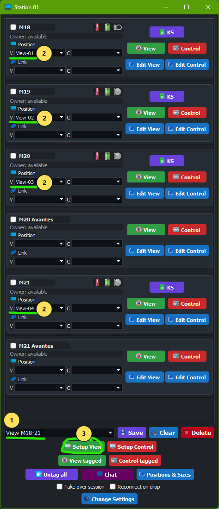
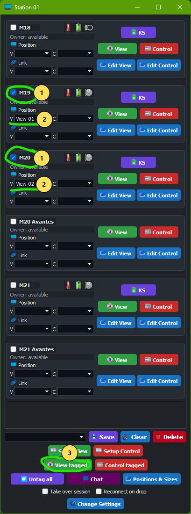
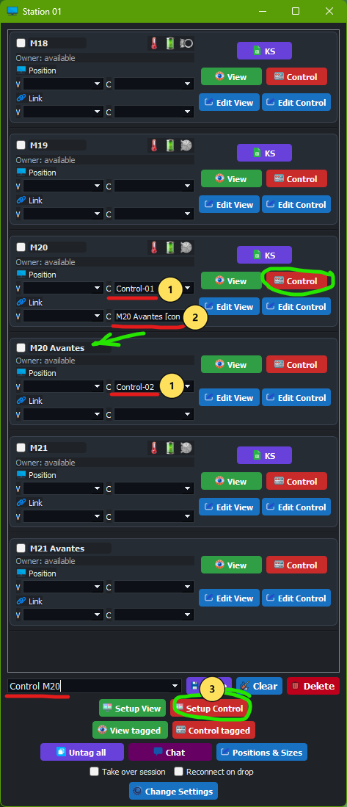
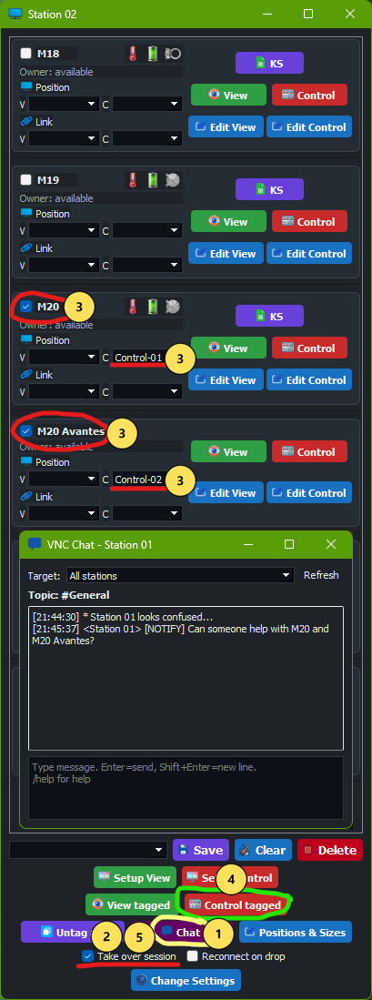

# VNC Station User Manual

Training-focused guide for production operators, with a dedicated admin setup section.

## Table Of Contents

- [1. Who This Manual Is For](#1-who-this-manual-is-for)
- [2. Operating Context](#2-operating-context)
- [3. Main Concepts](#3-main-concepts)
- [4. Main Window Quick Orientation](#4-main-window-quick-orientation)
- [5. Standard Shift Workflow (Operator)](#5-standard-shift-workflow-operator)
- [6. View Operations (Top 4K Monitors)](#6-view-operations-top-4k-monitors)
- [7. Control Operations (Lower Full HD Monitors)](#7-control-operations-lower-full-hd-monitors)
- [8. Takeover And Collaboration Between Stations](#8-takeover-and-collaboration-between-stations)
- [9. Alarm And Indicator Handling](#9-alarm-and-indicator-handling)
- [10. Chat Usage During Production](#10-chat-usage-during-production)
- [11. Admin Setup And Configuration](#11-admin-setup-and-configuration)
- [12. Troubleshooting](#12-troubleshooting)
- [13. Shift Handover](#13-shift-handover)
- [14. Good Practices](#14-good-practices)
- [15. Screenshot References](#15-screenshot-references)
- [16. Glossary](#16-glossary)

## 1. Who This Manual Is For

- Primary audience: production operators (daily use).
- Secondary audience: admin or experienced personnel who configure stations.

Scope:

- Operator workflows for monitoring and intervention.
- Admin setup for HA/API settings, positions, and session defaults.

## 2. Operating Context

Typical station layout:

- 4 monitors per station.
- 2 top 4K monitors for `View` sessions (overview).
- 2 lower Full HD monitors for `Control` sessions (active adjustments).

Typical usage:

- Operators monitor groups of machines in `View`.
- Operators intervene in `Control` when alarms/anomalies occur.
- Helper machines are often linked to production machines for guided adjustments.

## 3. Main Concepts

- `View`: overview/surveillance session.
- `Control`: intervention session.
- `Pos V` / `Pos C`: predefined window positions for view/control.
- `Setup`: saved tags + positions + links for fast switching.
- `Tagging`: temporary selection for batch open/close.
- `Link`: open/close paired sessions together.
- `Session lock`: prevents unintended duplicate access across stations.
- `Take over session`: explicit override for collaborative assistance.

## 4. Main Window Quick Orientation

Each row gives:

- machine name and owner status
- `Pos V` / `Pos C`
- `Link V` / `Link C`
- `View` / `Control`
- `Edit View` / `Edit Control`
- optional Active button(s): default `KS`/`KSV`/`KSC` or custom `Active Button Text`

Bottom controls include:

- setup selector with `Save`, `Clear Setup`, `Delete`
- `Setup View` / `Close View`
- `Setup Control` / `Close Control`
- tagged actions (`View tagged`, `Control tagged`, close variants)
- `Untag all`, `Chat`, `Positions & Sizes`
- `Take over session`, `Reconnect on drop`
- `Change Settings`

## 5. Standard Shift Workflow (Operator)

1. Start app and wait for session synchronization.
2. Load the setup for your line/area.
3. Confirm top-monitor view coverage.
4. Confirm lower-monitor control pair(s).
5. Watch indicators/labels continuously.
6. If alarm/anomaly occurs, switch to relevant control flow.
7. Coordinate using chat when extra support is needed.

## 6. View Operations (Top 4K Monitors)

### 6.1 Open a Saved View Setup

1. Select setup in selector.
2. Verify `Pos V` values for included sessions.
3. Click `Setup View`.

Example:

Number legend:

1. Choose the saved setup in the setup selector.
2. Verify `Pos V` assignment on the sessions included in this setup.
3. Click `Setup View`.

### 6.2 Build a Temporary View Group (Tagging)

1. Tag wanted machines.
2. Confirm each has `Pos V`.
3. Click `View tagged`.

Example:

Number legend:

1. Tag machine(s) to include.
2. Select view position(s).
3. Click `View tagged`.

### 6.3 When To Use Which

- Use saved `Setup View` for recurring production modes.
- Use `View tagged` for temporary investigative monitoring.

## 7. Control Operations (Lower Full HD Monitors)

### 7.1 Standard Control Setup

1. Set `Pos C` for target sessions.
2. Configure `Link C` where machine + helper should operate together.
3. Click `Setup Control`.

Example:

Number legend:

1. Use `Control` on target machine row for single-session control, if needed.
2. Verify linked helper relation (`Link C`) for paired operation.
3. Click `Setup Control` for the full predefined control setup.

### 7.2 Intervention Pattern

1. Open affected production machine in `Control`.
2. Open/helper session (linked automatically when configured).
3. Apply changes recommended by helper system.
4. Keep team informed in chat.

## 8. Takeover And Collaboration Between Stations

Default behavior:

- A session in use is locked to the current station.

Collaboration flow:

1. Request help via chat.
2. Assisting station enables `Take over session`.
3. Assisting station opens relevant control session(s).
4. Work together until stable.
5. Disable takeover when no longer needed.

Example:

Number legend:

1. Check the Chat (if not open already).
2. Enable `Take over session` on assisting station.
3. Tag & set Pos C on machine A needing collaborative control, tag & set Pos C on machine B/Avantes as/if needed.
4. Click `Control tagged` to open tagged control set.
5. Disable `Take over session` when assisting is over.

## 9. Alarm And Indicator Handling

- Alarm-related indicator/label color changes are high-priority.
- Multiple icons may show status in the same row.
- Not all indicators are critical; alarm-state visuals take precedence.

Operator rule:

- Treat alarm visual changes as immediate-action events.

## 10. Chat Usage During Production

Use chat for:

- support requests
- handover notes
- abnormal-event coordination

Useful commands:

- `/help`
- `/nick <Name>`
- `/topic <Topic>`
- `/me <Action>`
- `/away [Message]`
- `/notify [Message]`

Recommendation:

- Use `/notify` only for urgent attention.

## 11. Admin Setup And Configuration

This section is for admin/advanced users.

### 11.1 Initial Station Configuration

1. Open `Change Settings`.
2. Set Home Assistant URL.
3. Set HA API key.
4. Test HA connection.
5. Save settings.

### 11.2 Position Setup (Global Layout)

Use `Positions & Sizes` in `Position` mode to define reusable monitor positions:

- top 4K layouts for `View`
- lower Full HD layouts for `Control`

Save each position preset for reuse via `Pos V` / `Pos C`.

### 11.3 Session-Specific Window Setup

Use `Positions & Sizes` in `Session` mode, or `Edit View` / `Edit Control`, when no position preset is selected:

- configure default geometry per session
- set label location/style used for both `Sessions` and `Positions`
- set `Active Folder` (folder or file path) used by the row Active button
- set optional `Active Button Text` to replace default button text
- configure sensor icons and optional color rules

This is the fallback behavior used when `Pos V` / `Pos C` is not set.

### 11.4 Setup Presets For Operators

Prepare production-ready setup presets:

1. Assign positions and links.
2. Tag sessions as needed.
3. Save named setup (for example line, product, or mode).
4. Validate by loading the setup and opening `Setup View` and `Setup Control`.

### 11.5 Validate And Backup

- Run `Validate config`.
- Export config as backup.
- Import known-good config when deploying to another station.

## 12. Troubleshooting

### Session does not open

- Verify `.vnc` exists in `vnc-view` or `vnc-control`.
- Verify `tvnviewer.exe` exists in root.
- Check if another station owns session.

### Session opens on wrong monitor/position

- Verify assigned `Pos V` / `Pos C`.
- Recheck preset in `Positions & Sizes`.

### Cannot access session due to lock

- Coordinate in chat with owner station.
- Use takeover only when collaboration is required.

### Indicators missing or incorrect

- Verify HA URL/API key.
- Recheck sensor mapping in edit dialogs.

## 13. Shift Handover

1. Inform next operator in chat.
2. Confirm active setup(s).
3. Confirm active alarms and current actions.
4. Confirm takeover toggle state.
5. Export config if on-shift setup changes were made.

## 14. Good Practices

- Keep control sessions limited to what is needed.
- Keep setups stable and named clearly.
- Use tagging for temporary cases.
- Turn off takeover when done.
- Respond immediately to alarm-state visuals.

## 15. Screenshot References

Captured workflow screenshots for this manual are stored in `docs/manual-assets/images/`.

Core workflow files:

- `full-station-overview.png`
- `setup-view-workflow-01-empty.png`
- `setup-view-workflow-02-loaded.png`
- `setup-view-workflow-03-view-open.png`
- `setup-control-workflow-01-empty.png`
- `setup-control-workflow-02-loaded.png`
- `setup-control-workflow-02-open.png`
- `tagging-workflow-01-tagged.png`
- `tagging-workflow-02-view-open.png`
- `tagging-workflow-03-control-open.png`
- `takeover-flow-01-lock-state.png`
- `takeover-flow-02-take-over-enabled.png`
- `takeover-flow-03-both-connected.png`
- `alarm-and-escalation-01-alarm-active-main.png`
- `alarm-and-escalation-02-label-bg-color.png`
- `alarm-and-escalation-03-chat-notify.png`
- `alarm-and-escalation-04-prod-help-link.png`
- `settings-maint-01-valid-config.png`
- `settings-maint-02-invalid-config.png`
- `settings-maint-03-reconnect-on-drop.png`

Optional supporting files:

- `optional-useful-01-chat-commands.png`
- `optional-useful-02-ks-ksv-ksc.png`
- `optional-useful-03-position-editor-load-save.png`
- `optional-useful-03-session-editor-load-save.png`

Numbered callout variants:

- `setup-view-numbered.png`
- `setup-control-numbered.png`
- `view-tagged-numbered.png`
- `control-tagged-takeover-numbered.png`

## 16. Glossary

- `View`: surveillance mode.
- `Control`: intervention mode.
- `Setup`: saved operational state.
- `Position`: saved geometry preset.
- `Tag`: temporary selection marker.
- `Link`: paired session behavior.
- `Take over`: explicit lock override for collaboration.
