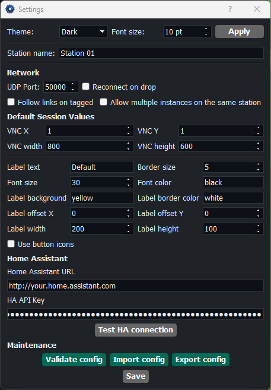

# VNC Station Admin Guide

Audience: administrators responsible for deployment, station settings, networking, validation, and recovery.  
App version: `1.7.2`

## When To Use This Guide

Use this guide when you need to:

- deploy a new station
- verify the required file and folder structure
- configure network and reconnect behavior
- validate or replicate a station configuration
- troubleshoot discovery, launch, or instance issues

For operator workflows, see [User Guide](user-guide.md).  
For layout and session preparation, see [Advanced User Guide](advanced-user-guide.md).

## 1. Deployment Checklist

Every station should have:

- application package or source tree
- `tvnviewer.exe`
- `default.json`
- optional `default.local.json`
- `vnc-view/`
- `vnc-control/`
- optional `vnc-positions/`
- optional `vnc-setups/`
- `logs/`

Before handover:

1. confirm all required files exist
2. confirm `.vnc` files open with saved credentials
3. confirm station settings can be opened
4. run validation

## 2. Critical VNC Password Rule

This is mandatory:

- each `.vnc` file must already contain its saved password
- View and Control should use separate credentials on the VNC side

Do:

- re-save `.vnc` files with `tvnviewer.exe` after password changes
- verify `vnc-view` and `vnc-control` separately

Do not:

- deploy `.vnc` files without stored passwords
- reuse one shared password for all roles if the environment expects View/Control separation

## 3. First-Time Station Setup

Open `Settings` and configure the station before production use.



Figure 1: Settings window for network, reconnect, HA, validation, and save operations.

Key areas in this screenshot:

- `Appearance`: theme and font size
- station row: `Station name`
- `Network`: shared `UDP Port`
- `Network`: `Reconnect on drop`
- `Network`: `Follow links on tagged`
- `Network`: `Allow multiple instances on the same station`
- `Network`: `Keep main window on top`
- middle settings area: default VNC and label values, plus `Use button icons`
- lower settings: Home Assistant URL and API key
- bottom: maintenance actions and `Save`

Recommended sequence:

1. set station name
2. set the shared UDP port
3. decide whether `Reconnect on drop` should be enabled
4. decide whether tagged sessions should follow their saved links automatically
5. keep `Allow multiple instances on the same station` disabled unless explicitly required
6. enable `Keep main window on top` if operators need the controller pinned above other windows
7. configure HA URL and API key if HA is used
8. run `Test HA connection`
9. save

Expected result:

- station opens with the intended identity and network settings
- reconnect behavior matches your policy
- follow-link and top-most behavior match operator workflow
- main window title shows the station name plus app version
- minimized in-use owner icons identify the holding station in the tooltip

## 4. Network And Firewall Compatibility

All stations must:

- use the same UDP port
- allow UDP traffic on that port
- be able to see each other on the network segment used for broadcast traffic

Use the included UDP test script:

```powershell
.\tests\scripts\udp-port-test.ps1 -Mode listen -Port <UDP_PORT>
.\tests\scripts\udp-port-test.ps1 -Mode send -Port <UDP_PORT> -TargetIP <TARGET_IP> -Message "UDP test"
```

Firewall example for port `50000`:

```powershell
New-NetFirewallRule -DisplayName "VNC Station UDP 50000" -Direction Inbound -Protocol UDP -LocalPort 50000 -Action Allow
```

## 5. Validation And Maintenance

Use the Settings window for:

- `Validate config`
- `Import config`
- `Export config`
- `Save`

Recommended maintenance routine:

1. validate after any manual file change
2. export a known-good bundle after major updates
3. import only trusted bundles
4. validate again after import

Important behavior:

- import rejects unsafe zip paths that try to escape the repo folders
- the open Settings window refreshes after import

What validation is for:

- missing `tvnviewer.exe`
- missing required folders
- malformed JSON in station defaults or session files
- other file-layout problems that would break runtime behavior

## 6. Station Replication Workflow

Use this to clone a known-good configuration across stations.

1. fully verify one reference station
2. export a configuration bundle
3. import the bundle on the target station
4. update station-specific values if needed
5. validate the target station

Check after import:

- station name
- UDP port
- HA credentials
- required `.vnc` files and optional presets
- whether the imported setup order and position/session assets match the reference station

## 7. Operational Guardrails

Recommended policy:

- keep stations on the same app version on all stations
- disable multiple local instances by default
- document whether reconnect-on-drop is expected
- document whether `Follow links on tagged` and `Keep main window on top` should be enabled on production stations
- avoid normalizing shared-session workflows unless operations explicitly require them
- export a known-good config bundle after any major approved configuration change

## 8. Troubleshooting

| What you see | Likely cause | What to check next |
|---|---|---|
| stations do not discover each other | UDP mismatch or firewall block | verify same port and test both directions |
| app reports another instance is already running | single-instance protection is active | close the existing instance or intentionally allow multiple instances |
| sessions do not launch | missing `tvnviewer.exe` or `.vnc` files | verify runtime layout and run validation |
| VNC authentication fails | wrong or missing password in `.vnc` | re-save the `.vnc` file and verify server credentials |
| dropped sessions stay down | reconnect is disabled | check `Reconnect on drop` in Settings |
| operators see blocked sessions often | station ownership conflict | verify workflow, staffing, and whether shared-session policy is being used correctly |
| validation fails after a manual edit | malformed JSON or a missing artifact was introduced | fix the reported file and run validation again before handover |
| import succeeds but the station still behaves differently | station-specific values or local files were left behind | review station name, UDP port, HA settings, and required runtime folders |

## 9. Acceptance Test After Deployment

Use this before handing the station to operators:

1. launch the app
2. confirm connection rows load
3. open one View session
4. open one Control session
5. open chat and verify it works
6. if another station is available, verify cross-station discovery and one chat exchange
7. validate the configuration
8. export a backup bundle
9. confirm the station settings persist after reopen

## 10. Recovery Priorities

If a station is unstable:

1. stop operator changes
2. export what is still usable if possible
3. run validation
4. verify `default.json` and local overrides
5. verify UDP port and firewall
6. re-import a known-good bundle if needed
7. rerun the acceptance test
