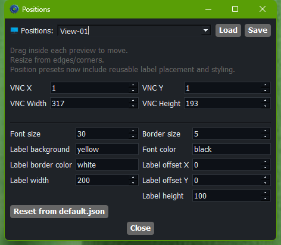
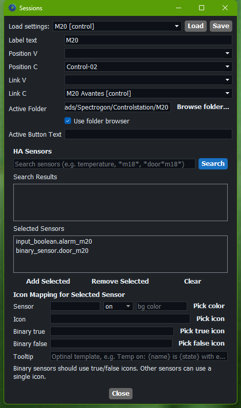

# VNC Station Advanced User Guide

Audience: power users who prepare layouts, setups, links, Active Folder behavior, and Home Assistant mappings.  
App version: `1.7.0`

## When To Use This Guide

Use this guide when you need to:

- create or adjust reusable positions
- edit per-session layout and label behavior
- build operator-ready setups
- configure Active Folder and custom row buttons
- configure Home Assistant sensors and visuals

For day-to-day operation, see [User Guide](user-guide.md).  
For deployment and network maintenance, see [Admin Guide](admin-guide.md).

## 1. Configuration Workflow

Recommended order:

1. prepare reusable positions
2. assign fixed per-session positions and edit per-session settings
3. configure links and Active Folder behavior
4. configure HA sensors and indicators if needed
5. build and test saved setups for operators
6. hand over a validated setup list

This order matters because setups depend on positions and links already being correct.

## 2. Create Reusable Positions

Use `Positions` for reusable VNC geometry and reusable label visual settings.

Typical flow:

1. Open `Positions`.
2. Move and size the VNC preview and the label preview.
3. Save the preset.
4. Apply that preset from `Pos V` or `Pos C` in the main window.

Use the `Positions` window for reusable VNC geometry plus label offset, size, font, colors, and border styling.

To set session-specific `label_text`, fixed positions, links, Active Folder behavior, or HA sensor mapping, use the `Sessions` window.

Figure 1: Positions window for reusable VNC placement and label visual presets.

## 3. Edit One Session In Detail

Use `Edit View`, `Edit Control`, or `Sessions` when you need to change one target in detail.

Use `Sessions` for:

- label text
- fixed `Position V` / `Position C` assignments
- `Link V` / `Link C`
- Active Folder
- Active Button Text
- HA sensors and icons

Figure 2: Sessions window for per-session editing.

Key areas in this screenshot:

- top: `Load settings`
- center: `Label text`, `Position V/C`, and `Link V/C`
- `Active Folder` row: folder-or-file path plus `Browse...` and folder/file toggle
- below that: `Active Button Text`
- HA area: search field, search results, selected sensors, and per-sensor mappings

Expected result after saving:

- the session JSON for the chosen target is updated
- the next time the session opens, it uses the updated behavior
- if `position_name` is set to a valid position preset, that preset geometry and label visual settings are used at launch

## 4. Configure Active Folder

Use `Active Folder` / `Active Path/File` when operators need quick access to related files from the row.

Behavior:

- in the per-session edit dialog, the checkbox selects file mode when checked
- in the `Sessions` window, the checkbox selects folder mode when checked
- `Active Button Text` changes the visible row button text

Good uses:

- production logs
- output folders
- trace folders
- job-specific notes

Recommended test:

1. save the session
2. reopen the target row
3. click the active button
4. confirm the correct file opens
5. confirm the toast shows the full resolved path you expected

If the path points at a folder, test with realistic file churn so you confirm the newest expected file is the one operators actually get.

## 5. Build Operator-Ready Setups

A setup stores:

- `Pos V`
- `Pos C`
- `Link V`
- `Link C`

Power-user note:

- setups can also preserve current tag state when saved
- this is best treated as an optional advanced shortcut, not the primary tagging workflow
- normal day-to-day tagging is still intended for temporary `View tagged` and `Control tagged` work

Recommended setup-building process:

1. assign positions first
2. assign links if any sessions should open together
3. type the setup name
4. save it
5. click the saved setup to verify it restores correctly
6. drag the setup list into the preferred operator order

Expected result:

- operators can click one setup and immediately get the prepared state back
- setup apply affects the live UI only and does not rewrite the session JSON files

## 6. Configure Linked Sessions

`Link V` and `Link C` allow one session action to open or close a related session chain.

Use links when:

- one helper view should open together with a main machine
- one control action should always bring along an overview screen
- paired diagnostic machines should stay together

Validation checklist:

1. open the first session
2. confirm the linked one opens too
3. close the first session
4. confirm the linked one closes too
5. confirm the linked child row renders nested under the parent row in the main window when expanded

## 7. Configure Home Assistant Sensors

Use the session editor to configure:

- selected sensors
- icon mapping
- binary true/false icons
- tooltip templates
- binary state color rules

Behavior to remember:

- multiple icons can be shown in one row header
- saved order follows the drag order in `Selected Sensors`
- press `Enter` in the search field to run the search immediately
- use `*` wildcards for contains-style matching, for example `*m18*` or `*door*m18*`
- color rules can affect the row indicator area and overlay label background
- malformed session JSON or defaults can fall back to safe defaults, with a toast/log warning for troubleshooting

Recommended workflow:

1. verify HA connection in `Settings`
2. add sensors to the session
3. assign icons
4. test both normal and alarm states
5. verify the result in the main window

Good practice:

- keep alarm colors visually distinct from normal-state colors
- keep tooltip text short enough to read quickly during a live issue
- test both the row indicator and the opened-session label background if you use color rules

## 8. Shared Session Guardrail

`Allow shared sessions` is an operator-side override, but advanced users should decide when that workflow is acceptable.

Use it only for controlled collaboration.

Do:

- document when operators may use it
- explain when it must be turned off again

Do not:

- build setups that assume shared sessions are always allowed

## 9. Validation After Any Change

Run this after editing positions, sessions, links, or setups:

1. open one View session and verify placement
2. open one Control session and verify placement
3. test any linked sessions
4. apply the saved setup
5. test Active Folder if configured
6. confirm HA visuals if configured
7. confirm `Close all sessions` clears local windows cleanly

## 10. Troubleshooting

| What you see | Likely cause | What to check next |
|---|---|---|
| position preset seems ignored | wrong `Pos V` / `Pos C` or old setup state | reapply the setup and verify the row selectors |
| label looks wrong | edited in the wrong place or wrong position preset | reopen `Positions` and verify the preset used by the session |
| Active Folder opens the wrong file | unexpected newest file in folder | verify folder contents and timestamps |
| HA icons do not update | wrong entity ID or missing HA config | verify HA settings and sensor IDs |
| operators say setup is wrong | setup was saved before latest edits | re-save and re-test the setup |
| session settings appear partly ignored | a valid `position_name` preset is overriding manual geometry | check whether the session is supposed to follow a saved position |
| a session falls back to default behavior after editing | malformed JSON was ignored | check the toast/log warning and fix the JSON file |

## 11. Handover To Operators

Before handover:

1. save clear setup names
2. reorder the setup list for operator convenience
3. verify View and Control positions
4. verify links are intentional
5. verify Active Folder behavior
6. verify any HA alarm visuals
7. explain any exceptional shared-session workflow
