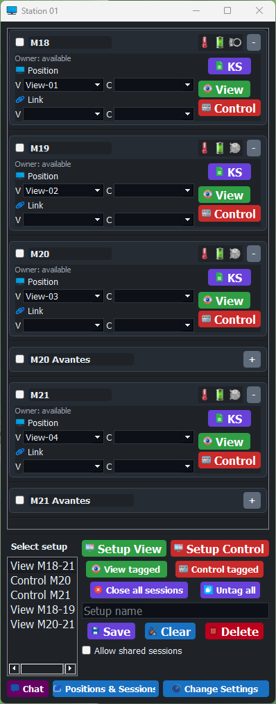
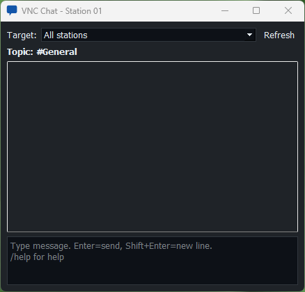

# VNC Station User Guide

Audience: operators using the app during normal production work.  
App version: `1.5.1`

## When To Use This Guide

Use this guide when you need to:

- start a shift
- load and use saved setups
- open View or Control sessions
- coordinate with other stations in chat
- understand what to do when something does not open

For layout/setup editing, see [Advanced User Guide](advanced-user-guide.md).  
For deployment, networking, and station maintenance, see [Admin Guide](admin-guide.md).

## Quick Sheet

Most common actions:

- load a prepared setup: click it in the setup list
- open the monitoring layout: click `Setup View`
- open one machine for interaction: click row `Control`
- open a temporary tagged group: tag rows, then click `View tagged` or `Control tagged`
- close everything local: click `Close all sessions`
- coordinate with another station: click `Chat`
- allow a shared session intentionally: enable `Allow shared sessions`, do the task, then disable it again

## 1. Main Window Overview

The app has two main areas:

- a scrollable list of machines/sessions
- a lower control area for setups, batch actions, and tools

Figure 1: Main operator window with connection rows and the lower setup/session control area.

Key areas in this screenshot:

- left side: setup list
- upper right: `Setup View` and `Setup Control`
- below that: tagged View/Control actions
- next row: `Close all sessions` and `Untag all`
- next row: `Setup name`, then `Save`, `Clear`, and `Delete`
- lower right: `Allow shared sessions`
- bottom row: `Chat`, `Positions & Sessions`, and `Change Settings`

## 2. Start Of Shift

Prerequisites:

- the station is already configured
- the required `.vnc` files and setups already exist

Steps:

1. Start the app.
2. Wait a few seconds for station and session sync to finish.
3. Click the setup you want in the setup list.
4. Confirm the rows look correct for the shift.
5. Click `Setup View` if you want the prepared monitoring layout.

Expected result:

- the setup applies immediately
- prepared View sessions open in the expected positions
- rows already owned by another station stay blocked unless you intentionally allow shared sessions

If it fails:

- read the toast message
- if the message says another station already holds a session, coordinate in chat first

## 3. Open One Session

Use this when you need only one machine.

To open one View session:

1. Find the row.
2. Click `View`.

To open one Control session:

1. Find the row.
2. Click `Control`.

Expected result:

- the session window opens
- the button changes to its close state for that mode

If it fails:

- check the toast for missing `.vnc` file, lock, or configuration issues

## 4. Open A Tagged Group

Use this for temporary batch work without saving a setup first.

Steps:

1. Tag the rows you want.
2. Make sure those rows have the needed `Pos V` or `Pos C`.
3. Click `View tagged` or `Control tagged`.

Expected result:

- all tagged rows for that mode open locally
- clicking the same action again closes that tagged mode group

Good use cases:

- temporary operator batch monitoring
- incident response on several machines
- ad-hoc control set during troubleshooting

## 5. Use Saved Setups

Setups now use a list instead of the older selector box.

To apply a setup:

1. Click the setup name in the list.

To save a new setup:

1. Arrange positions and links.
2. Type a name into `Setup name`.
3. Click `Save`.

To clean up setup state:

1. Click `Clear` to clear setup-driven UI state.
2. Click `Delete` to remove the selected setup.

Useful detail:

- you can drag setups in the list to reorder them
- that custom order is saved on the station

Expected result:

- applying a setup immediately restores its saved positions and links

## 6. Shared Sessions

By default, if another station already has a machine open, your station is blocked from opening that same machine.

Use `Allow shared sessions` only when two stations intentionally need the same session at the same time.

Safe workflow:

1. Coordinate in chat.
2. Enable `Allow shared sessions`.
3. Open the session you need.
4. Finish the shared work.
5. Disable `Allow shared sessions`.

Do:

- use it only when operators have agreed on the task
- turn it off immediately after use

Do not:

- leave it enabled as a normal operating mode
- use it to bypass coordination

## 7. Chat During Operation

Use chat for coordination, handover, and escalation.

Figure 2: Chat window with target selector, topic area, chat log, and input box.

Key areas in this screenshot:

- top: target selector and refresh
- center: topic line and chat log
- bottom: message input area

Common chat uses:

- ask another station to release a session
- announce shared-session work
- hand over unfinished tasks
- send a `/notify` message for urgent attention

Useful commands:

- `/help`
- `/nick <Name>`
- `/topic <Topic>`
- `/me <Action>`
- `/away [Message]`
- `/notify [Message]`

Use `/notify` when another station needs to notice something immediately, such as a blocked critical session or an urgent handover.

## 8. Alarm And Indicator Handling

Row indicators are meant to be read continuously during operation.

Things operators should watch for:

- a row header icon changes state
- an alarm color appears in the indicator area
- the overlay label background on an open session changes color
- chat receives an urgent `/notify` message related to the same machine or area

Recommended response:

1. identify which row changed
2. decide whether View is enough or whether Control is needed
3. coordinate in chat before opening shared Control work
4. document handover or escalation in chat if the issue continues

Expected result:

- the affected machine is monitored or controlled without creating confusion between stations

## 9. How To Recognize A Healthy Session

Things to look for:

- the intended View or Control window opens
- row indicators show expected status
- the owner line makes sense
- the action you clicked changes to its close/toggle state
- no warning toast appears

If something looks wrong:

1. stop opening more sessions
2. read the current toast or chat notice
3. escalate to an advanced user or admin depending on the problem

## 10. Troubleshooting

| What you see | Likely cause | What to do next |
|---|---|---|
| Nothing opens when you click | session blocked or file missing | read the toast and coordinate if another station owns it |
| `Setup View` or `Setup Control` opens only some rows | one or more rows are blocked or invalid | check the toast details and the prepared setup |
| A session opens in the wrong place | wrong position or wrong setup | ask an advanced user to check positions or setup content |
| Chat does not show other stations | UDP/firewall/network problem | escalate to admin |
| A dropped session does not return | reconnect behavior may be disabled | ask admin to check `Reconnect on drop` in Settings |
| A machine shows alarm colors or icons you do not expect | HA state changed or a mapping is configured for alarms | treat it as an operational signal first, then ask an advanced user to verify the mapping if needed |
| The row has a useful file button but it opens the wrong item | Active Folder points at a folder and a different file is now the newest one | tell the advanced user which row was affected so the session configuration can be checked |

## 11. End Of Shift

Recommended closeout:

1. Finish any active shared-session work.
2. Disable `Allow shared sessions` if it was used.
3. Close local sessions with `Close all sessions`.
4. Send any needed handover note in chat.
5. Confirm the next operator knows which setup should be used.
